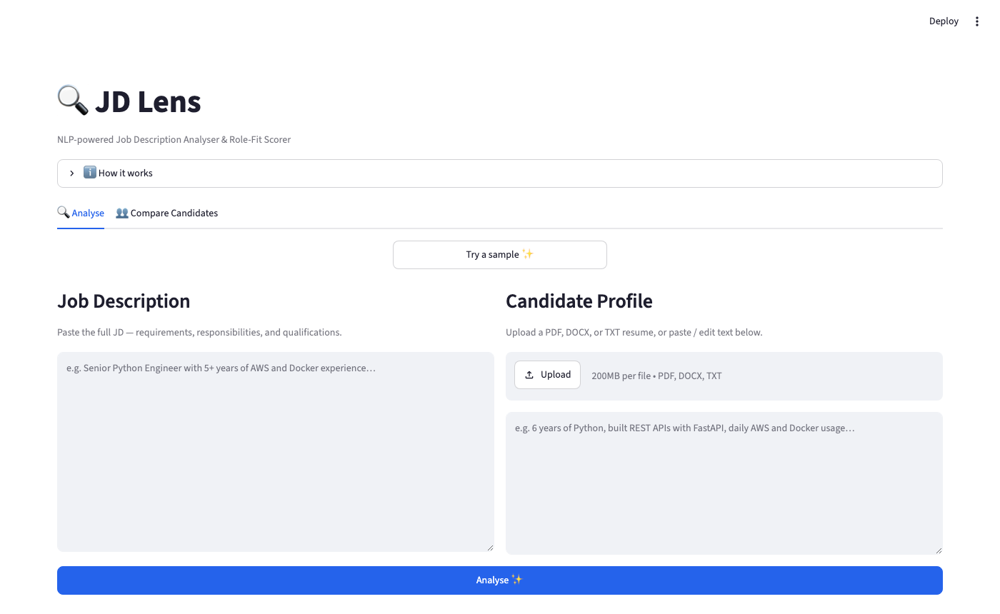
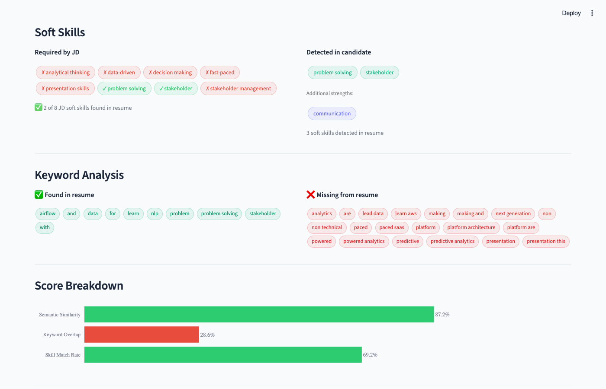

# JD Lens 🔍

## NLP-powered Job Description Analyser & Role-Fit Scorer

[](https://github.com/Dhyey2901/jd-lens/actions/workflows/ci.yml)
[](https://www.python.org/)
[](https://jd-lens-ahnqxbthuw8t3tdr4mnuaw.streamlit.app/)
[](LICENSE)

Paste any job description and a candidate profile — JD Lens extracts key signals, classifies every sentence by intent, and scores candidate fit using a hybrid of **semantic embeddings**, **TF-IDF**, and **explicit skill matching**.

**🚀 Live demo: [jd-lens-ahnqxbthuw8t3tdr4mnuaw.streamlit.app](https://jd-lens-ahnqxbthuw8t3tdr4mnuaw.streamlit.app/)**

---

## Demo

**Input** — paste or upload a JD + resume (PDF, DOCX, TXT):



**Output** — fit score gauge, JD signals, colour-coded skill tags:



---

## Features

| Feature | Technique | Detail |
| --- | --- | --- |
| **Skill & Tool Extraction** | Regex phrase matching | 80+ tools across languages, cloud, ML, DevOps |
| **Unknown Tool Detection** | Context-phrase NLP | Catches tools not in core vocabulary via "experience with X" patterns |
| **Seniority / Education / Work Type** | Keyword signals | Parsed directly from JD text |
| **Sentence Classification** | Zero-shot NLI | `facebook/bart-large-mnli` → Required / Nice-to-Have / Responsibility / Company Info |
| **Semantic Fit Score** | Cross-encoder + Sentence Transformers | `cross-encoder/ms-marco-MiniLM-L-6-v2` on Required sentences; bi-encoder fallback |
| **Required-only Scoring** | Classifier-gated | Semantic score computed against Required sentences — not filler or company info |
| **Keyword Overlap Score** | TF-IDF + CountVectorizer | 0.6 × TF-IDF cosine + 0.4 × unigram top-20 overlap (30% weight) |
| **Skill Match Rate** | Regex + semantic embedding | Exact hit + 0.5 × semantic match over JD skills (40% weight) |
| **Section-aware Chunking** | Header regex | Detects SKILLS / EXPERIENCE sections; prioritises skills section in blob fallback |
| **Alias Normalisation** | Dictionary substitution | sklearn → scikit-learn, postgres → postgresql, etc. |
| **Gap Analysis** | Set difference | Keyword and skill gaps surfaced clearly |
| **Result Caching** | SHA-256 in-process cache | Repeated (JD, candidate, skills) triples skip all model inference |
| **Downloadable Report** | JSON export | Full structured analysis per run |

---

## Architecture

```text
jd-lens/
├── app.py              # Streamlit UI — model caching, charts, layout
├── api.py              # FastAPI REST layer — /analyse + /health endpoints
├── config.py           # Central config — models, weights, vocabulary
├── extractor.py        # Pure-regex JD signal extraction + unknown tool detection
├── classifier.py       # HuggingFace zero-shot sentence classification
├── scorer.py           # Hybrid scorer: cross-encoder + TF-IDF + skill match + cache
├── utils.py            # Multi-format document extraction (PDF, DOCX, TXT)
├── tests/
│   ├── test_extractor.py
│   ├── test_scorer.py
│   └── test_api.py
├── .github/workflows/
│   └── ci.yml          # GitHub Actions — pytest + ruff on Python 3.11/3.12
└── requirements.txt
```

### Scoring formula

```text
fit_score = 0.30 × semantic_similarity   (cross-encoder on Required sentences; bi-encoder fallback)
          + 0.30 × keyword_overlap        (0.6 × TF-IDF cosine + 0.4 × top-20 unigram overlap)
          + 0.40 × skill_match_rate       (exact hit × 1.0 + semantic hit × 0.5, over JD skills)
```

When no skills are detected in the JD (e.g. unusually formatted), the 40% skill weight is
redistributed proportionally to semantic and keyword so scores stay meaningful.

---

## Quickstart

```bash
git clone https://github.com/Dhyey2901/jd-lens.git
cd jd-lens

python -m venv .venv && source .venv/bin/activate   # Windows: .venv\Scripts\activate
pip install -r requirements.txt

streamlit run app.py
```

> **First run:** `facebook/bart-large-mnli` (~1.6 GB) and `all-MiniLM-L6-v2` (~80 MB) are downloaded automatically by HuggingFace and cached in `~/.cache/huggingface/`. Subsequent runs load from cache and start in seconds.

---

## Running Tests

```bash
pip install pytest
pytest tests/ -v
```

---

## Deploying to Streamlit Cloud

1. Push this repo to GitHub.
2. Go to [share.streamlit.io](https://share.streamlit.io) → **New app** → connect repo.
3. Set **Main file path** to `app.py`.
4. Click **Deploy**.

Streamlit Cloud installs `requirements.txt` automatically. Allow ~3 minutes for cold start while models download.

---

## Tech Stack

- [Streamlit](https://streamlit.io) — UI & deployment
- [sentence-transformers](https://www.sbert.net/) — bi-encoder + cross-encoder scoring
- [HuggingFace Transformers](https://huggingface.co/facebook/bart-large-mnli) — zero-shot classification
- [scikit-learn](https://scikit-learn.org/) — TF-IDF + CountVectorizer keyword overlap
- [FastAPI](https://fastapi.tiangolo.com/) — REST API layer
- [Plotly](https://plotly.com/python/) — interactive charts

---

## License

MIT
